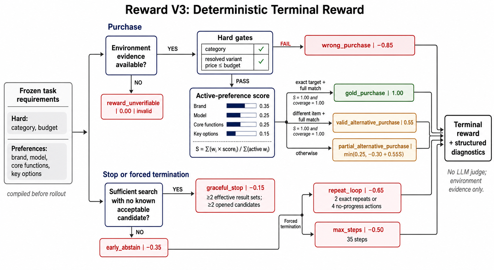
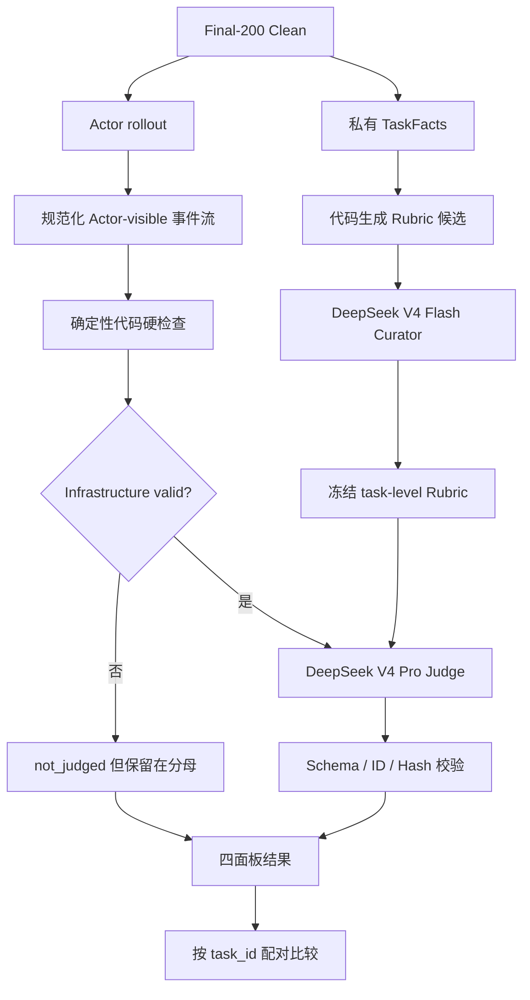

# 长程购物 Agent：SFT + GRPO + Experience-Augmented Agent Loop

> ShopSimulator Environment v2.1 × Qwen3.5-2B × LoRA SFT × veRL GRPO × Reward v3 × Frozen-Actor Experience Loop

我从 0 到 1 构建了一个面向复杂中文购物需求的长程 Agent 优化系统：将网页购物环境封装成严格的工具协议，采集并审计 Teacher 轨迹，通过 Assistant-only LoRA SFT 建立可用的工具策略，再使用 veRL 0.8 + vLLM 进行在线 GRPO。后训练达到平台期后，我冻结 Actor 参数，从 Teacher/Student 成败轨迹中按阶段沉淀程序性 Experience Card，并在搜索停滞、候选进入、购买前核验与 Guard rejection 等关键事件上做按需召回和临时注入。整个训练、经验演化和 Final-200 Clean 评测过程均保留版本、哈希与轨迹级审计信息。


## 核心结果

三个模型使用相同的 Final-200 Clean、Environment v2.1、Reward v3、工具协议和确定性推理配置进行评测；每个任务只执行一次 rollout，所有任务始终保留在固定的 200 题分母中。

| 模型 | 完成率 | 严格成功率 | 购买成功率 | 平均 Reward | 平均步数 | Guard 拒绝 |
|---|---:|---:|---:|---:|---:|---:|
| Qwen3.5-2B Base | 18.0% | **0.0%** | 0.0% | -0.1105 | 5.875 | 752 |
| LoRA SFT | 96.5% | **60.5%** | 60.5% | 0.4729 | 12.335 | 52 |
| GRPO step 100 | 96.5% | **62.0%** | 62.5% | 0.5158 | 11.850 | 38 |

SFT 完成了最关键的能力跃迁：模型从不会稳定使用购物协议，提升到能够搜索、核验证据、选择规格并执行购买。GRPO 的净增幅更小，但同时带来了平均 Reward 提升、错误购买减少、循环和最大步数终止减少，以及 Guard 拒绝继续下降。这说明在线 RL 的作用不只是多完成几题，也包括对约束满足和动作策略的进一步收敛。

在 GRPO step 100 上冻结同一 Actor，不再更新任何模型参数，只启用 Experience-Augmented Agent Loop：

| 运行方式 | Actor 参数 | 严格成功率 | 绝对提升 | 相对提升 |
|---|---|---:|---:|---:|
| GRPO Actor | Frozen | **62.0%** | — | — |
| GRPO Actor + Agent Loop | Frozen | **67.0%** | **+5.0pp** | **+8.1%** |

这里的 67.0% 不是另一个训练 checkpoint：两组结果使用相同 Actor、Final-200 Clean 和推理协议，差异只来自事件驱动的经验召回与请求级注入。

## 1. 问题定义：为什么购物 Agent 是一个长程决策任务

复杂购物需求并不是一次检索或一次分类。Agent 必须在有限步数内完成一条有状态的决策链：

```text
理解需求
  → 组织搜索词
  → 浏览候选集合
  → 打开并比较商品
  → 核验详情、功能与规格
  → 选择影响价格的 variant
  → 重新确认最终价格
  → 购买或有依据地放弃
```

这个任务同时包含四类难点：

- **状态依赖**：商品、按钮和规格只能从最新页面读取，历史页面中的目标可能已经失效。
- **长上下文**：一次 rollout 包含多轮 Assistant tool call 与环境 observation，且训练时必须保持 token、response mask 和 log probability 对齐。
- **稀疏终局反馈**：真正决定任务是否成功的是最终购买结果，中间动作本身没有可靠的人工分数。
- **约束冲突**：品类和预算不能被偏好补偿；品牌、型号、功能与规格又需要在证据充分的前提下综合判断。

因此，我没有把项目实现为“给模型几个网页工具”，而是围绕环境生命周期、动作合法性、可见信息边界、终局 Reward 和评测审计建立了完整 Harness。

## 2. Agent Harness：把 ShopSimulator 接入 veRL AgentLoop

### 2.1 端到端适配链路

```mermaid
flowchart LR
    A[Task ID] --> B[ShopSimulatorSession]
    B --> C[env_idx 独占租约]
    C --> D[13 类 JSON Schema 工具]
    D --> E[Action Guard]
    E --> F[ShopSimulator Environment v2.1]
    F --> G[Observation v2 投影]
    G --> H[ShoppingToolAgentLoop]
    H --> I[veRL rollout / logprob 对齐]
    I --> J[Reward v3 终局结算]
    J --> K[轨迹与训练诊断]
```



项目没有重写 veRL 的生成器，而是在 `ToolAgentLoop` 的关键边界插入购物任务所需的约束：

1. Session 启动时申请独立环境租约并绑定任务状态；
2. 模型生成标准 JSON tool call；
3. Action Guard 根据最新 observation 做执行前校验；
4. 合法调用转换为 ShopSimulator 的 `search[...] / click[...] / finish[...]` 动作；
5. 原始环境结果投影为预算受控、但保留可操作目标的 observation；
6. 正常终局后只信任环境返回的 Reward v3；
7. 无论成功、异常还是提前终止，都在 `finally` 中释放环境租约。

核心实现位于：

- [`agent_loop.py`](src/shopping_grpo/training/grpo/adapter/agent_loop.py)：veRL AgentLoop 生命周期、上下文预算、Observation 投影和终局结算；
- [`session.py`](src/shopping_grpo/training/grpo/adapter/session.py)：环境租约、异步边界和 trajectory-local 状态；
- [`tools.py`](src/shopping_grpo/training/grpo/adapter/tools.py)：工具执行、Guard 统计和 Reward v3 验收；
- [`client.py`](src/shopping_grpo/environment/client.py)：ShopSimulator HTTP 协议与 `env_idx` 路由；
- [`actions.py`](src/shopping_grpo/environment/actions.py)：Action Guard；
- [`projection.py`](src/shopping_grpo/environment/projection.py)：Observation 投影。

### 2.2 13 类工具 Schema

我将原始网页动作拆成 13 个职责单一的工具，并为每个工具冻结参数 Schema、必填字段和 `additionalProperties=false`：

| 能力 | 工具 | 约束 |
|---|---|---|
| 搜索 | `search_products` | 只在当前页面允许搜索时执行，query 必须包含品类与关键约束 |
| 候选进入 | `open_product` | ASIN 必须来自最新搜索结果 |
| 规格选择 | `select_option` | 规格值必须来自当前商品页，不能把导航按钮当作规格 |
| 证据核验 | `view_description`、`view_features`、`view_reviews`、`view_attributes` | 只有当前页面存在对应按钮时才能进入 |
| 页面导航 | `next_page`、`prev_page`、`back_to_search` | 只能点击当前 observation 中真实存在的导航目标 |
| 终局动作 | `buy_now`、`finish_without_purchase` | 购买不可撤销；无货放弃必须使用冻结 reason |
| 辅助动作 | `think` | 不访问环境，仍消耗有限步骤；正式提示词要求优先执行能带来新证据的动作 |

工具 Schema 和环境动作转换共享同一份源定义，避免“模型看到的工具”与“运行时真正执行的动作”发生漂移。训练、Teacher 采集和固定评测都复用这套协议。

### 2.3 Action Guard：非法动作不进入环境

网页环境中最常见的错误并不是 JSON 解析失败，而是模型使用了过期页面中的商品或按钮。Action Guard 在调用 ShopSimulator 前检查：

- 是否传入了 Schema 未声明的额外参数；
- 当前页面是否允许搜索；
- `open_product` 的 ASIN 是否出现在最新搜索结果；
- `select_option` 的值是否是当前页面规格，而不是导航按钮；
- Description、Features、Reviews、Attributes、翻页、返回和购买按钮是否真实存在；
- 一轮是否只产生一个工具调用。

被拒绝的调用不会改变环境状态。Harness 会返回结构化的工具错误，附带当前可用商品与按钮，让 Actor 有机会恢复；连续三次 Guard rejection 则终止轨迹，避免无效循环继续占用 rollout 预算。每次拒绝的原因、所在步数以及是否发生在 Observation 截断之后都会进入训练和评测诊断。

### 2.4 Session、并发隔离与请求归属

每条 trajectory 都由一个 `ShopSimulatorSession` 管理：

- `reset(task_id)` 从服务端租用一个环境实例，并获得唯一 `env_idx`；
- 后续 `interact` 和 `release_one` 始终携带同一个 `env_idx`；
- 阻塞式 HTTP 客户端通过 `asyncio.to_thread()` 调用，不阻塞 veRL 的异步事件循环；
- `current_environment` 与 `current_runtime_state` 使用 Python `ContextVar` 绑定到当前 coroutine；
- `finally` 负责显式释放，避免异常路径泄漏 slot。

因此并发 rollout 的隔离不是依赖一个共享全局变量，而是由“服务端独占租约 + 客户端 `env_idx` 路由 + coroutine-local 状态”共同保证。HTTP 响应会返回发起调用的同一等待协程，Harness 再把结果写回该 trajectory 的状态。

### 2.5 Observation 投影与上下文预算

ShopSimulator 的原始页面可能远大于模型真正需要的信息。我为不同页面设置独立预算：

| Observation 类型 | Token 预算 |
|---|---:|
| 搜索结果 | 1,536 |
| 商品详情 | 4,096 |
| 通用回退页面 | 768 |
| 搜索候选上限 | Top 20 |

投影的原则不是简单截断字符串，而是优先保留：

- 当前页面类型；
- Actor 可以打开的商品 ID；
- 当前可点击按钮；
- 商品关键字段、可选规格与当前 variant 价格；
- Action Guard 下一步判断所需的 footer。

如果投影后无法保留完整动作契约，Harness 会把轨迹标记为 infrastructure invalid，而不是继续让模型在损坏的 observation 上行动。

GRPO 训练还支持按完整 `assistant tool-call + tool observation` 交互组压缩旧上下文。裁剪时同步修改 `prompt_ids`、`response_mask` 和 `response_logprobs`，保留固定 Prompt 与最新完整工具组，避免只裁文本却破坏策略梯度对齐。模型上下文上限为 24,576 tokens，每回合最多生成 512 tokens，并额外保留安全余量。

## 3. Teacher 轨迹、LoRA SFT 与在线 GRPO

### 3.1 Teacher 轨迹采集与数据隔离

我使用 DeepSeek V4 Flash 在真实 ShopSimulator 环境中采集 2,498 条轨迹。验收不依赖第二个模型打分，而是直接使用环境的确定性终局结果：只有完整执行且满足 `gold_purchase + reward_valid=true` 的轨迹才能进入 SFT 数据。

| 数据阶段 | 数量 |
|---|---:|
| 原始 Teacher 轨迹 | 2,498 |
| 通过严格验收 | 1,026 |
| 冻结进入主数据集 | 1,000 |
| 训练 / 验证 | 800 / 200 |

数据构建过程还执行以下硬检查：

- 每个 task ID 最多保留一条轨迹；
- 去除 Guard violation、错误购买、部分满足、循环、最大步数和 Reward 不可验证样本；
- 从训练消息中移除 audit-only 字段和隐藏 Reward 内容；
- SFT、GRPO train/validation 与 Final-200 Clean 保持 task ID 零重叠；
- 文件行数、任务集合、配置和 SHA-256 写入 metadata。

后续我将 Pure V4 数据池扩展并去重到 1,192 条唯一任务轨迹，其中 1,073 条作为训练数据、119 条作为 development 数据；课程划分、难度标签和完整任务 ID 固定在 [`data/sft_curriculum/manifest.json`](data/sft_curriculum/manifest.json)。

### 3.2 Assistant-only LoRA SFT

SFT 的目标不是让模型复述环境页面，而是学习“在什么状态下采取什么动作”。因此训练标签只覆盖 Assistant 输出：

```text
System / User tokens       → IGNORE_INDEX
Tool observation tokens   → IGNORE_INDEX
Assistant text/tool calls → 参与 loss
```

主要训练设置：

| 设置 | 值 |
|---|---|
| Base model | Qwen3.5-2B |
| 最大序列长度 | 24,576 |
| LoRA rank / alpha / dropout | 16 / 32 / 0.05 |
| Attention | SDPA |
| Gradient checkpointing | 开启 |
| 监督目标 | Assistant-only Loss |

保留长上下文是必要的：一条样本包含完整多轮购物交互，过早截断可能删除最终购买决策，或者删除支撑该决策的前序证据。

### 3.3 veRL 0.8 在线 GRPO

SFT checkpoint 合并后作为 GRPO 初始策略。每个训练 prompt 在线生成 4 条 rollout，模型以 `temperature=0.7 / top_p=0.9` 与真实 ShopSimulator 交互，环境终局 Reward v3 直接作为优化信号；项目不训练、也不启用独立 Reward Model。

| 设置 | 值 |
|---|---|
| 框架 | veRL 0.8 + vLLM |
| 每个 prompt 的 rollout | 4 |
| GRPO train / validation task | 1,000 / 50 |
| Policy learning rate | `1e-6` |
| LoRA rank / alpha | 16 / 32 |
| 最大模型长度 | 24,576 |
| KL reward / KL loss | 关闭 / 关闭 |
| 报告 checkpoint | step 100 |

#### 有界 Dynamic Sampling

标准 GRPO 依赖组内相对优势；如果同一 prompt 的全部 rollout 奖励相同，组内标准差为零，无法提供有效更新。我的处理方式是：

1. 按 prompt UID 聚合 4 条 rollout；
2. 先剔除 infrastructure invalid、Reward 不可验证和超长无效样本所在的 Group；
3. 再过滤 terminal utility 在容差内完全相同的零方差 Group；
4. 保留有有效奖励差异的 Group，并对所有对齐 tensor 和非 tensor 字段使用同一索引裁剪；
5. 最多追加生成 3 个 batch，仍无有效 Group 时显式跳过 optimizer update；
6. 连续跳过达到 10 次后终止训练，防止无信号任务导致无限重采样。

每个 generation batch、保留/过滤原因、终局 Reward、工具序列和 Guard 诊断都会写入 `training_diagnostics.jsonl`；optimizer step 另外保存 entropy、PPO KL、clip fraction、response length 和有效 Group 比例，便于区分“模型没有学到”与“当前 batch 根本没有形成训练信号”。

## 4. Reward v3：确定性、约束感知的终局奖励

### 4.1 设计目标

Reward v3 解决三个问题：

1. **不能只用目标 ASIN 判断一切**：目录中可能存在满足全部需求的替代商品；
2. **硬约束不能被软偏好抵消**：错误品类或超预算不能因为品牌、功能相似而获得正奖励；
3. **缺少证据不等于不满足**：价格或规格不可验证时不能随意给负分或正分，更不能作为有效 GRPO 样本。

因此 Reward v3 是一个由环境证据驱动的确定性终局函数，而不是 LLM-as-a-Judge Reward Model。

### 4.2 冻结任务约束

在 rollout 开始前，系统从任务 Query、已有标注和目标商品元数据编译固定 Reward features：

- 商品 category；
- Query 明确出现、且能与目标商品对齐的品牌别名；
- Query 与目标元数据共同出现的型号标识；
- 标注的核心功能；
- 颜色、尺码、容量、套餐等必要选项；
- 明确预算上限及可复现的口语预算解析。

这些约束在 Actor 行动前冻结。策略无法通过自己的输出修改后续评分标准。

### 4.3 Hard Gate：品类与预算

购买必须同时通过两个硬门槛：

- **Category Gate**：所购商品属于目标品类；
- **Budget Gate**：根据已选择规格解析出的最终 variant 价格不超过预算。

任一 Gate 明确失败，结果为 `wrong_purchase = -0.85`。如果关键证据无法从环境解析，结果为 `reward_unverifiable = 0.0`，同时设置 `reward_valid=false`；这个 0 不是中性成功，也不会进入有效 GRPO Group。

预算核验使用最终 variant 价格，而不是搜索卡片上的展示价。这避免 Agent 先看到低价区间，选择高价规格后仍被误判为预算内。

### 4.4 Soft Preference：只在激活维度上归一化

通过 Hard Gate 后，Reward 才计算品牌、型号、核心功能和关键规格：

| 维度 | 权重 |
|---|---:|
| 品牌 | 0.35 |
| 型号 | 0.25 |
| 核心功能 | 0.25 |
| 关键规格 | 0.15 |

只对当前任务真实激活的维度归一化：

```text
match_score = Σ(weight_i × score_i) / Σ(active weight_i)
```

系统使用相同权重计算 `evidence_coverage`。只有 `match_score=1` 且 `evidence_coverage=1`，才能认为全部偏好被可靠满足。这样可以避免两个问题：没有品牌要求的任务不会平白损失品牌分；模型也不能靠“缺少证据”绕过未核验项。

### 4.5 终局类型与效用映射

| 终局类型 | Reward | 设计含义 |
|---|---:|---|
| `gold_purchase` | `1.00` | 目标 ASIN，Hard Gate 与全部激活偏好均满足 |
| `valid_alternative_purchase` | `0.55` | 不同 ASIN，但完整满足同一约束 |
| `partial_alternative_purchase` | `min(0.25, -0.30 + 0.55 × S)` | Hard Gate 通过，但软要求仅部分满足 |
| `graceful_stop` | `-0.15` | 充分探索后确实没有已知可接受候选 |
| `early_abstain` | `-0.35` | 搜索和候选核验不足便放弃 |
| `max_steps` | `-0.50` | 用尽 35 步仍未完成 |
| `repeat_loop` | `-0.65` | 重复动作或连续无新证据 |
| `wrong_purchase` | `-0.85` | 错误品类或超过预算 |
| `reward_unverifiable` | `0.00`, invalid | 环境证据不足，禁止制造训练结论 |

部分满足公式把最高奖励限制在 0.25，确保“没有满足全部需求的购买”与“完整有效替代品”之间存在明确间隔。

### 4.6 放弃与循环终止

`finish_without_purchase` 不是免费退出。只有同时满足以下条件才属于 graceful stop：

- 至少检查 2 个有效结果集合；
- 至少打开 2 个候选；
- 没有已知可接受候选；
- 已知可接受的判断要求 Hard Gate 通过、匹配度至少 0.70、证据覆盖至少 0.75。

环境还跟踪有效证据增量：新结果集合、新商品、详情子页、规格选择和约束检查都可以构成 progress，但每类证据的记分次数有上限。连续两次完全相同动作，或连续四步没有新增运行时证据，都会触发 `repeat_loop`；总步数上限固定为 35。



## 5. Rubric 与可审计评测 Harness

Reward 回答“最终买得对不对”，Rubric/Judge 回答“过程为什么好或坏”。二者保持独立：Reward v3 决定严格成功和终局效用，Rubric 负责逐项需求解释，Trajectory Judge 负责搜索、核验、决策和终止过程诊断。

### 5.1 三层评测结构



### 5.2 代码先生成候选，Curator 不能自由创造要求

系统先从 Query、任务标注、目标商品结构和 Reward features 中生成候选约束：

| 候选类型 | 底层表示示例 |
|---|---|
| Category | `product.category in_category ...` |
| Brand / Model | `product.brand eq ...` / `product.model eq ...` |
| Core Function | `product.attributes contains ...` |
| Option | `purchase.options.* eq ...` |
| Budget Upper | `purchase.price lte ...` |
| Price Range | `purchase.price between ...` |
| Price Preference | `purchase.price approximately ...` |

每个候选都带有稳定 `candidate_id`、字段路径、操作符、期望值、Query span、数据来源和 selection guidance。DeepSeek V4 Flash 只负责：

- 从候选中选择 Query 真正表达的要求；
- 合并同义或上下位重复约束；
- 将要求标记为 `hard / soft / needs_review`；
- 给出 Query 原文引用和选择理由；
- 生成简短的人类可读描述。

Flash 不能新增字段、修改操作符或改写 expected value。物化最终 Rubric 时，底层语义字段仍从代码候选复制；响应还要通过 task ID、candidate ID、Schema、Query span 和版本 Hash 校验。冻结后的同一份 task-level Rubric 由 Base、SFT 和 GRPO 共享，避免为不同模型重新解释需求。

### 5.3 轨迹规范化与代码硬检查

原始 rollout 会被统一转换为稳定事件流：

- 每个动作尝试生成 `action_attempt_id`；
- 每个实际执行步骤生成 `executed_step_id`；
- 每个 Actor 可见事件生成 `event_id`；
- Guard rejection 作为独立事件保留，不与成功执行的步骤混淆；
- raw observation、隐藏目标和私有 task facts 默认不进入 Judge 输入。

在调用 Judge 之前，代码确定性计算：

- Reward、终局类型、strict success 与 purchase success；
- 工具次数、步数、候选打开数和购买/放弃次数；
- malformed tool call、Guard rejection、非法动作与 step error；
- 重复动作、重复搜索和 environment repeat loop；
- Observation 截断、上下文 token、compaction 和 overflow；
- release error、任务缺失及其他 infrastructure invalid。

基础设施无效轨迹直接标记为 `not_judged`，但仍留在固定 200 题分母内，防止通过删除失败样本抬高成绩。

### 5.4 Judge 可见信息隔离

DeepSeek V4 Pro 只能看到 Actor 当时真正能看到的轨迹证据：

| Judge 可以看到 | Judge 看不到 |
|---|---|
| 用户 Query 与冻结 Rubric | Gold ASIN 和目标商品私有字段 |
| Assistant 文本、工具名和参数 | raw observation |
| 投影后的 Actor-visible observation | Reward 分数、reward type 和 hard gates |
| Guard rejection、step error、event ID | strict success 与代码成功结论 |
| 合法性、重复、效率、上下文白名单指标 | 其他模型在同一任务的结果 |
| 中性的 `done / over` | infrastructure validity 结论 |

这种隔离避免 Judge 因提前看到 Gold 或 Reward 而倒推“轨迹一定正确”，也让它的每项判断都必须引用真实 `event_id`。

### 5.5 五维过程诊断

| 维度 | 0 分 | 1 分 | 2 分 |
|---|---|---|---|
| Search Strategy | 搜索遗漏核心要求或机械重复 | 初始搜索合理但改写一般 | 覆盖关键条件并能有效调整 |
| Candidate Utilization | 忽略明显候选 | 候选合理但比较不足或冗余 | 能利用候选证据并及时收敛 |
| Evidence Verification | 未核验关键证据 | 只核验部分要求 | 购买前完成关键属性、规格和价格核验 |
| Decision Quality | 违反硬约束或错误终止 | 基本合理但仍有缺口 | 选择与终局决策均有证据支持 |
| Termination Efficiency | 过早购买/放弃、循环或耗尽步骤 | 存在轻度冗余 | 证据充分后及时结束 |

Judge 对每条 Rubric 输出 `satisfied / violated / unknown / not_applicable`，并从冻结错误类型中选择一个 primary error 和最多两个 secondary errors。系统禁止输出综合总分，防止不同性质的问题被一个不可解释的数字掩盖。

### 5.6 四面板结果与配对比较

每道题最终保留四组互不覆盖的结果：

1. **Reward 与终局**：严格成功、购买成功、Reward 类型和有效性；
2. **确定性过程指标**：动作、重复、合法性、上下文和基础设施状态；
3. **Rubric 逐项判断**：每个用户要求的满足状态和证据事件；
4. **五维轨迹诊断**：搜索、候选、核验、决策与终止，以及错误分类。

最终比较按 `task_id` 配对，而不是只比较两个总体平均值。这样可以直接看到哪些任务从失败变成功、哪些任务发生回退，以及提升主要来自协议能力、约束满足还是行为效率。

## 6. Frozen Actor 的 Experience-Augmented Agent Loop

### 6.1 为什么在 GRPO 之后增加经验层

从 SFT 60.5% 到 GRPO 62.0% 后，继续更新 2B Actor 的收益已经明显变小。剩余错误更多表现为长程决策中的局部失误：搜索结果已经停滞却继续同义改写、找到正确候选后过度探索、进入详情后漏掉关键证据、选择规格后没有重新核验最终价格，或者 Guard 拒绝后重复相同非法动作。

这些错误具有明确的触发状态和修复程序，适合沉淀为“触发条件—建议动作—完成验证”，不一定需要继续写入模型权重。因此我保留 GRPO Actor 不变，在外部增加一条可审计的经验演化链路：

```mermaid
flowchart LR
    A[Teacher / Student trajectories] --> B[Actor-visible event stream]
    B --> C[按连续 phase 切分 Segment]
    C --> D[DeepSeek V4 Flash 顺序结构化抽取]
    D --> E[六维键精确聚类]
    E --> F[Cluster → Experience Card]
    F --> G[Schema / 泄漏 / 去重 / 版本检查]
    G --> H[配对 A/B 与 Store 回归]
    H --> I[Hash-frozen Active Store]
    I --> J[关键事件触发召回]
    J --> K[请求级临时注入]
    K --> L[Frozen GRPO Actor]
```



训练链路和经验链路保持正交：Agent Loop 不修改 LoRA、GRPO checkpoint 或 Actor 权重；Active Store 在一次运行开始后只读，Final-200 的轨迹也不会回流到经验库。

### 6.2 第一步：把 trajectory 切成连续决策 Segment

我先将原始 rollout 规范化为 Actor 当时真实可见的事件，再按连续 `phase` 切分，而不是直接让大模型总结整条长轨迹。当前 phase 集合为：

```text
task_understanding → search → candidate_screening → detail_verification
                   → option_selection → pre_purchase → termination
异常动作单独进入 error_recovery
```

这些是阶段标签，不是单向状态机；返回搜索结果、切换候选或 Guard 恢复都可以让后续 Segment 重新进入较早 phase。

每个 Segment 明确保存：

- 自己拥有的连续 `event_range` 和完整事件；
- 前后各 2 个相邻事件，供模型理解进入原因和离开结果；
- `trajectory_id / task_id / actor_role / source_kind`；
- 代码从事件中直接得到的状态谓词，例如 `guard_rejected`、`candidate_new`、`has_multiple_options`、`repeated_search` 和 `search_no_new_candidates`；
- 轨迹终局类型，但不把 Gold、Reward detail 或 raw observation 写入可复用经验正文。

Segment 的“所有权”很重要：抽取结果可以引用前后上下文，但必须至少引用一个当前 Segment 自己的 `event_id`。这样后续聚类和 Experience Card 的每个判断都能回溯到真实局部证据，而不是来自整条轨迹的模糊印象。

实现：[`segmentation.py`](src/shopping_grpo/experience/segmentation.py)

### 6.3 第二步：逐 Segment 做格式化抽取，并传递前序知识

Segment 按轨迹顺序交给 DeepSeek V4 Flash。第一个 Segment 从空知识状态开始；之后每一次调用都会收到前序 Segment 已确认的抽象知识，并通过稳定 `knowledge_id` 显式引用：

```text
prior_knowledge = []
for segment in trajectory_segments:
    extraction = extract(segment, context_before, context_after, prior_knowledge)
    validate_schema_evidence_and_leakage(extraction)
    prior_knowledge = tail(prior_knowledge + extraction.carried_knowledge, 24)
```

模型输出不是自由文本总结，而是固定的 `SegmentExtraction`：

| 字段组 | 结构化内容 | 用途 |
|---|---|---|
| 状态变化 | `before / decision / after` | 解释进入状态、动作和状态增量 |
| 失败定位 | `failure_type` | 区分搜索停滞、候选误选、证据缺失、规格错误、过度搜索、Guard rejection 等 |
| 约束 | `constraint_tags` | `category / budget / brand / model / core_function / option` |
| 状态 | `state_predicates` | 描述召回所需的可验证条件；代码观测值会强制并入，不能被模型漏掉 |
| 动作 | `action_pattern` | 搜索改写、打开候选、比较、核验、选规格、验价、购买、恢复等 |
| 局部结果 | `local_outcome` | `progress / no_progress / recovered / terminal_* / unknown` |
| 正反模式 | `positive_pattern / anti_pattern` | 保留本阶段证据支持的做法与错误 |
| 知识传递 | `prior_knowledge_refs / carried_knowledge` | 让后续 Segment 使用前序已确认约束、候选、证据、策略和风险 |
| 证据 | `evidence_event_ids` | 将每个结论绑定到输入事件 |

抽取器使用严格字段集合和枚举校验，拒绝不存在的 event/knowledge 引用、重复知识、商品 ID、具体价格、Gold/Reward 字段及隐藏 observation。换句话说，模型负责把局部逻辑格式化，代码负责决定哪些字段合法、哪些证据真实存在。

实现：[`segment_extraction.py`](src/shopping_grpo/experience/segment_extraction.py)

### 6.4 第三步：按六维聚类键精确归并

完成结构化抽取后，不再按“同一任务、相似 Query 或 lexical similarity”直接合并轨迹，而是由代码构造以下六维键：

```text
cluster_key = (
    phase,
    failure_type,
    sorted(constraint_tags),
    sorted(state_predicates),
    action_pattern,
    terminal_outcome,
)
```

只有六个维度完全一致的 Segment 才进入同一 Cluster。由此可以把下列模式稳定地区分开：

- 搜索阶段的“重复查询且没有新候选”；
- 已经找到候选后仍继续过度搜索；
- 详情核验阶段缺少品牌、型号或核心功能证据；
- 多规格商品在购买前没有核验最终 variant 价格；
- 相同阶段、相同状态下出现同类 Guard rejection；
- 相似动作在成功和失败终局中的不同表现。

Cluster 会保留全部成员和来源计数。为了控制单次模型调用的上下文，大簇在合成 Card 时最多选择 16 个代表 Segment，并按 `actor_role + local_outcome + failure_type` 轮转取样；这只限制 LLM 输入，不改变完整聚类结果。`cluster_key` 和 SHA-256 均由代码生成，模型不能自行改键。

### 6.5 第四步：从 Cluster 合成可执行的 Experience Card

同一 Cluster 最多生成一张 Card。证据不足、只能总结某个具体商品，或无法形成跨任务程序时，模型必须返回 `null`。有效 Card 的核心合同如下：

```json
{
  "experience_id": "exp-verification-<cluster_hash>",
  "revision": 1,
  "status": "candidate",
  "type": "verification",
  "phase": "pre_purchase",
  "trigger": {
    "events": ["pre_purchase"],
    "page_types": ["product_detail"],
    "required_constraint_tags": ["budget", "option"],
    "predicates": ["has_multiple_options", "final_price_unverified"]
  },
  "guidance": ["完成规格选择后，重新读取当前 variant 的最终价格。"],
  "anti_patterns": ["不要使用搜索卡片中的价格替代最终规格价格。"],
  "verification_checks": ["最终价格可见且通过预算门槛后才允许购买。"]
}
```

Card 只保存程序性策略，不保存商品 ID、标题、具体价格或任务答案。运行时使用的 Card v1 还包含：

- 与 Environment v2.1、Reward v3、Observation v2、Tools v2 绑定的 scope；
- supporting/contradicting trajectory IDs 和支持数量；
- extractor、model revision、prompt version、created_at；
- `revision / supersedes / content_hash`；
- 独立 audit 中的 `cluster → segment → trajectory → event` 完整证据链。

Experience ID 由 `type + cluster_key_hash` 稳定生成。相同 ID 重新抽取时，新 Card 的 revision 自动递增并记录 `supersedes=<id>@<old_revision>`；内容完全相同的候选先按 semantic content hash 合并，避免重复注入。

离线入口：[`distill_experiences.py`](scripts/distill_experiences.py)

### 6.6 事件驱动召回：规则决定“何时召回”，排序决定“召回哪张卡”

当前方案不是每个 Agent turn 都做一次向量搜索。Runtime 先从 Actor 可见状态构建只读 `ExperienceStateView`，只在六类确定性事件上触发：

| 召回事件 | 代码触发条件 | 目标经验 |
|---|---|---|
| `task_start` | 尚未执行环境步骤 | 任务解析与初始搜索策略 |
| `search_stagnation` | 重复 query，或连续搜索得到相同候选集合 | 搜索改写与停止无效循环 |
| `candidate_opened` | 最新动作打开了一个候选 | 候选核验与比较顺序 |
| `pre_purchase` | 详情页已出现购买入口，且刚完成规格选择或详情核验 | 规格、最终价格与硬约束复核 |
| `guard_rejection` | 最新调用被 Action Guard 拒绝 | 按 rejection 原因恢复到合法动作 |
| `pre_finish` | 剩余步数不超过 5 且不在商品详情页 | 终止条件与最后一次有效检查 |

触发后先进行硬过滤：Card 的 event、phase、page type、required constraint tags、state predicates 和 category scope 必须与当前状态兼容。只有通过规则门槛的 Card 才进入排序，因此 lexical/embedding backend 负责的是候选排序，不负责决定是否触发。

默认使用 lexical weighted-Jaccard，将当前 Query、事件、phase、页面、约束和未核验项与 Card 的 trigger、guidance、anti-pattern 和 verification checks 对齐。实际分数还包含事件、phase、约束交集加分，以及同一 Card 在当前轨迹中被重复注入的惩罚：

```text
score = relevance
      + 0.20 * event_match
      + 0.10 * phase_match
      + 0.05 * matched_constraint_count
      - min(0.15, 0.03 * previous_injection_count)
```

配置默认取 `score >= 0.2` 的 Top-3。若需要替换为 embedding cosine，只改变通过硬过滤后的排序层，并要求所有 Active Card 都有固定 revision 对应的预计算向量。相同 `event + state` 会生成稳定 state signature 并复用召回结果，避免同一状态重复查询造成漂移。

实现：[`events.py`](src/shopping_grpo/experience/events.py)、[`retrieval.py`](src/shopping_grpo/experience/retrieval.py)、[`runtime.py`](src/shopping_grpo/experience/runtime.py)

### 6.7 请求级临时注入：经验不进入永久对话历史

召回结果只渲染三类内容：`guidance`、`anti_patterns` 和 `verification_checks`。注入头会明确声明它是可选程序性经验，当前页面、工具 observation、Action Guard 和系统规则优先级更高。

每次请求前，Runtime 深拷贝当前消息，在副本的 system message 尾部临时追加经验；原始 trajectory messages 不变，下一轮会根据新状态重新判断。注入使用 Actor 自己的精确 tokenizer 计算增量，预算固定为 500 tokens；超限时从低排名 Card 开始移除，直到满足预算。启用经验时还强制开启 DeepSeek V4 Flash 的语义上下文压缩，防止经验与长轨迹共同造成上下文溢出。

每次请求记录 `recall_event`、state signature、eligible/selected experience IDs、分数、revision/content hash 组成的 bundle hash、注入 token 数、缓存命中和 retrieval error。经验不会执行环境动作，也不会绕过 35 步限制。

实现：[`injection.py`](src/shopping_grpo/experience/injection.py)

### 6.8 经验治理：合同、版本、配对验证与冻结 Store

经验治理不是让另一个模型在召回后自由处理冲突，而是把可进入 Runtime 的内容约束为确定性发布流程：

1. **合同检查**：严格校验 Card 字段、枚举、phase-event 兼容性、Evidence ID、scope 和 semantic content hash；语义正文出现商品 ID、具体价格、Gold/Reward 或 raw observation 时直接拒绝。
2. **去重与 revision**：相同 semantic hash 合并证据；同一 `experience_id` 的更新生成更高 revision。只有新 revision 通过发布门槛时才覆盖旧 Active Card；若新版本被拒绝，则保留最后一个有效版本。不同 ID 的无关 Card 不做无证据的自动改写。
3. **候选级配对 A/B**：使用相同 Frozen Actor、任务和 sampling seed 比较关闭/开启经验；候选至少命中 20 个 pair，严格成功率必须提升且 10,000 次 Bootstrap 的 95% CI 下界不低于 0。
4. **负向门槛**：wrong purchase、reward unverifiable、Guard rejection、repeat loop 和 max steps 不得恶化；平均注入不超过 500 tokens/turn、最多 3 张 Card/turn。
5. **全库回归**：至少 50 个 pair，严格成功率允许的非劣界为 -1pp，基础设施无效数也不得增加。候选门槛和 Store 门槛必须同时通过，才能从 candidate 变为 active。
6. **冻结发布**：Active Store 以独立 JSONL + manifest 发布，记录 cards、embeddings、验证决策和配置的 SHA-256。一次 rollout 启动后只读取这份 snapshot，不接受运行中更新。

Final-200 始终是只读评测集：它不参与 Segment 抽取、Card 验证或 Store 更新。每次经验注入及语义压缩结果都进入 trajectory audit，从而可以回放“在哪个状态召回了什么、为什么选中、占用了多少上下文、是否改变了终局”。

实现：[`contracts.py`](src/shopping_grpo/experience/contracts.py)、[`validation.py`](src/shopping_grpo/experience/validation.py)、[`store.py`](src/shopping_grpo/experience/store.py)、[`promote_experience_store.py`](scripts/promote_experience_store.py)

### 6.9 Agent Loop 结果

在相同 GRPO step 100 Actor 上，关闭 Experience Runtime 的严格成功率为 62.0%；启用上述事件召回和临时注入后为 67.0%，绝对提升 5.0pp、相对提升 8.1%。整个增益来自推理时决策支持，Actor 权重保持冻结。

## 7. Final-200 Clean 与防泄漏

Final-200 Clean 是固定 200 题的盲测集合。它与 SFT、GRPO train/validation 保持 task ID 零重叠，并遵守以下边界：

- 不用于 Teacher 轨迹筛选或训练数据构建；
- 不用于 Prompt 调优、Rubric/Judge 校准或 checkpoint 选择；
- 公开数据文件只保存 task ID，私有 TaskFacts 在评测启动后从冻结环境恢复；
- Base、SFT、GRPO 使用同一 Collector、System Prompt、工具 Schema 和推理参数；
- 每题一次确定性 rollout，`temperature=0 / top_p=1`；
- 无终局或基础设施无效任务不从分母删除；
- 任务文件、运行配置、模型 revision、Prompt 版本和产物均通过 SHA-256 固定。

这种设计把“模型能力提升”与“训练/评测数据泄漏”“Judge 看到了答案”“失败任务被排除”等常见混淆因素分离开。

## 8. 代码结构

```text
longhorizon-agenticRL/
├── configs/                         # GRPO、AgentLoop、工具与实验配置
├── data/
│   ├── sft/                         # 冻结 SFT 数据与采集审计
│   ├── sft_pure_v4/                 # 1,192 条 Pure V4 轨迹池
│   ├── sft_curriculum/              # 固定课程划分与任务清单
│   ├── grpo/                        # GRPO train / validation
│   └── evaluation/                  # Final-200 Clean task IDs
├── environments/ShopSimulator/      # Environment v2.1 与 Reward v3
├── experiments/                     # Base / SFT / GRPO 配置和汇总
├── patches/                         # veRL 0.8 Dynamic Sampling 补丁
├── scripts/                         # 数据、训练、导出、评测与报告入口
├── src/shopping_grpo/
│   ├── collection/                  # Teacher → SFT 数据验收
│   ├── environment/                 # 工具、Guard、投影、上下文与客户端
│   ├── training/sft/                # Assistant-only SFT 数据集
│   ├── training/grpo/               # veRL AgentLoop 与 Dynamic Sampling
│   ├── experience/                  # Segment 抽取、聚类、召回、注入与 Store 治理
│   └── evaluation/                  # Rubric、Judge、轨迹与指标
└── tests/                            # 协议、Reward、训练与评测测试
```

## 9. 复现入口

```bash
# 安装环境
bash scripts/setup.sh

# 启动 ShopSimulator
bash scripts/start_environment.sh

# Teacher 轨迹采集
python scripts/collect_sft_data.py --help

# LoRA SFT
bash scripts/sft.sh

# 在线 GRPO
bash scripts/grpo.sh --dry-run
bash scripts/grpo.sh

# 离线 Segment 抽取、六维聚类与 Experience Card 蒸馏
python scripts/distill_experiences.py --help

# Frozen Actor 经验配对采集、门槛验证与 Store 发布
python scripts/collect_experience_rollouts.py --help
python scripts/validate_experience_results.py --help
python scripts/promote_experience_store.py --help

# 固定 Benchmark 评测
bash scripts/evaluate.sh baseline
bash scripts/evaluate.sh sft
bash scripts/evaluate.sh grpo
```

训练、模型合并和 Final-200 Clean 评测均由显式命令启动。数据文件、模型 checkpoint、运行配置与评测产物分别保存，避免一次实验隐式覆盖另一条实验链路。

## 10. 深入文档

- [Teacher 数据采集与审计](docs/data-collection.md)
- [LoRA SFT](docs/sft.md)
- [veRL GRPO](docs/grpo.md)
- [Reward v3 设计](docs/reward-v3.md)
- [可审计评测 Harness](docs/evaluation.md)
- [Final-200 Clean 数据合同](docs/evaluation-dataset.md)
- [Base → SFT → GRPO 实验对比](experiments/comparison.md)
